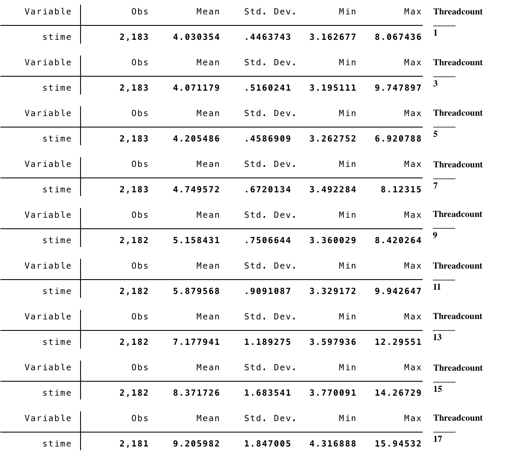

##  Project
I built a web scraper with Python's Selenium library, I implemented it as a multithreaded scraper. This project answers the simple question - what's the optimum threadcount?

### Background
As part of my work as an economics research assistant, I had to build a web scraper to to make a over 19,000 queries on a webpage. However, I couldn't easily resort to Python's Scrapy library as the data of interest is dynamically generated with JavaScript. To keep things simple, I used the testing framework Selenium to scrape with a webdriver (PhantomJS).

Each query takes from 4 to 10 seconds. Most of this query time came from the I/O with the webdriver. To speed up the whole process, I implemented as a multithreaded scraper with Python's threading library – so that multiple webdrivers can make separate queries simultaneously. (I may have to be more careful with the use of the word "simultaneously", as this program still shares one core).

Given this, I wanted to see what the optimum threadcount will be to optimize the scraping time. While having more threads would initially be more beneficial, eventually the overhead costs will rise high enough to the point that it brings down performance efficiency. I expect the time-performance to be a convex function with respect to threadcount - the purpose of this project being finding the minimum point.

### Setup
There were a total of 19,642 names (i.e., queries to make). The names were randomly shuffled, and then evenly split into 9 groups, where each group was assigned a threadcount number: 1, 3, 5, ..., 17. The Selenium webscraper was run on each of these groups with the assigned threadcount number. Each group contained about 2,180 names.

For control, when running the scraper, I:
- Limited my activity on my computer to very lightweight internet browsing and PDF viewing (studying for classes)
- Only used the university's internet connection

Each query/scrape involved the following:
- Recording the time
- Inserting the first name, last name, and clicking "search"
- Saving the resulting html page source with BeautifulSoup in a Python dictionary object
- Recording the time to get the scrape-time
- Saving the date/time and scrape-time in the dictionary

The webscraper was built to recursively handle multiple results pages, but it turned out that every single query results were contained in one result page (keeping the variation in scrape-time lower). Since the scraper was quite time-consuming, I also built it so that I can quit and then resume at any point, by using Python's pickle module to locally save the data (dictionary) at certain intervals. So, each query, in addition to being associated with a threadcount, was also given a 'sessionID' that was the recorded date/time when I started the program.

### Data
Based on the data kept track during the scrape, I was able to construct a 'relative time' measurement, rtime, for each scrape. This represents, for each threadcount, when a query/scrape finished relative to time 0, the starting time. I.e., if there were 9 scrapes performed with threadcount 3, then the maximum rtime of the 9 scrapes represents the time it took for the webscraper to finish scraping 9 names. Using the timedelta object in Python's datetime library and the scrape-time/sessionID recorded for each name, I was able to construct the rtime for all names in order to normalize the data across all threadcounts and sessions. Data was converted to a csv file to be analyzed with Stata.

### Results
Below is a collection of histograms, each showing the distribution of the scrapetime for a given threadcount. 

It can be seen that the variance and scrape increases with higher threadcount. A quick summary check on Stata confirms this - both the standard deviation and mean consistently increase with higher threadcount (see below for the table, threadcount added for label). I've also attached a mean-scrapetime vs. threadcount scatter.

Lastly - and most important - a scatter below of how long it took for the scraper to complete the ~2,180 queries, with the given threadcount. It levels off as the threadcount reaches 11. Some minor difference in finish time for threadcount in the range \[11,17], but most likely it's noise and nothing meaningful. (Note that the number of names to search differed by at most 2 across different threadcount groups, so the difference in query size had a negligible effect.)

|threadcount|time taken (minutes)|
|--|--|
|1|146.7085|
|3|49.56559|
|5|30.86245|
|7|24.88827|
|9|20.96805|
|11|19.76282|
|13|20.34001|
|15|20.60645|
|17|19.88363|

### Putting it together

###### Average, per-query scrapetime
The average scrape time goes up as threadcount increases. This seems reasonable: as threadcount increases, there is greater frequency and length of webdriver(s) being put on 'hold' as Python works on a webdriver from another thread. 

###### Overall scrapetime
While we observe the expected convexity (roughly) in the overall-scrapetime vs. threadcount scatter, it's not obvious where the minimum is achieved. It seems to level off when the threadcount is 11, but we don't see the at what point the overall scrapetime begins to increase again. This suggests the threadcount isn't high enough for overhead costs to affect the performance of the scraper - i.e., overhead costs become negligible in comparison to the scale of the scrapetime and random factors/noise that affect the performance. May be able to observe possible effects at threadcount ~20 or ~30, but most likely it only really matters at a much higher magnitude. 

### Best threadcount?
Based on this, the best threadcount seems to be anywhere in the range \[11,17]. However, threadcount>17 was not tested, so there is the possibility that for threadcount above some k>17, the performance improves, thereby breaking the convexity. (This doesn't seem intuitive though...)

Another thing to note is that CPU temperature increased quite a bit as I increased the threadcount on the webscraper. I had to use smcFanControl and manually set the fans at the highest RPM to keep the computer cool (even with the max fans, 70 celcius when threadcount was 15/17). Considering energy consumption, then, perhaps 11 or 13 would be the optimum threadcount.

### Extra
I could approach this more thoroughly by controlling for two things that I suspect affected the results. The first is date/time of when I left the scraper running. I can't say what the web traffic looks like for the webpage I scraped, but if I could control for the date/time of the scraper, then I would have less server-side performance variation (from traffic variation) affecting the results. The second is the names that were queried for each threadcount group. Instead of splitting up the names randomly and evenly, I can run each threadcount group on the same set of names – although there may be some cacheing issues to consider with this.

